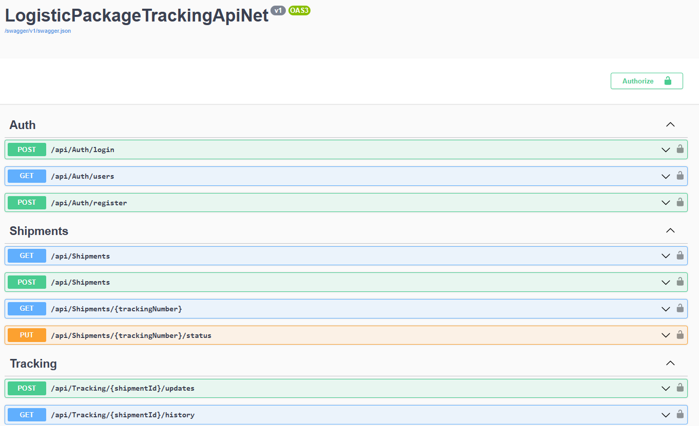

# LogisticsAndPackageTrackingApiNet

A robust, scalable API built with .NET 8 using Clean Architecture principles for managing logistics operations and real-time package tracking.

## Key Features
- **Shipment Management**: Create, update, and track shipments with ease.
- **Real-time Tracking**: Integrated tracking updates for packages with geolocation markers on a Leaflet map.
- **Dynamic Database Support**: Choose between SQL Server, PostgreSQL, MySQL, SQLite, or MongoDB at runtime via configuration.
- **Authentication & Security**: JWT-based authentication with BCrypt password hashing and Role-Based Access Control (Admin/Customer).
- **Asynchronous Messaging**: RabbitMQ integration for decoupled background processing (`email_queue`, `location_queue`).
- **Audit Logging**: Automatic tracking of data changes for security and compliance via `AuditLogs` table.
- **Email Notifications**: Brevo (Sendinblue) API integration for delivery confirmation emails. Falls back to direct HTTP when RabbitMQ is unavailable.
- **Automatic Documentation**: Interactive API documentation with Swagger/OpenAPI.
- **Geocoding Integration**: OpenStreetMap Nominatim geocoding for origin/destination coordinates and reverse geocoding for tracking updates.

## Technology Stack
- **Core Framework**: .NET 8
- **ORM**: Entity Framework Core (for RDBMS) & MongoDB Driver.
- **Messaging**: RabbitMQ (via `RabbitMQ.Client` 7.x)
- **Authentication**: JWT Bearer (custom, no ASP.NET Core Identity)
- **Password Hashing**: BCrypt.Net
- **API Documentation**: Swagger/Swashbuckle
- **Email**: Brevo (Sendinblue) via direct HTTP API + RabbitMQ consumer
- **Geocoding**: OpenStreetMap Nominatim
- **Testing**: xUnit, FluentAssertions, Moq
- **Design Patterns**: Clean Architecture, Repository Pattern, Unit of Work.

## Project Structure
The solution follows Clean Architecture principles:
- **.Api**: Entry point, Controllers, Middlewares, and Configuration.
- **.Application**: Business logic, Handlers, Interfaces, DTOs, and Messaging contracts.
- **.Domain**: Core entities, Interfaces, and Common types (independent of frameworks).
- **.Infrastructure**: Database persistence (EF & Mongo), Repositories, Messaging (RabbitMQ producer/consumer), and external services (Geocoding, Email, Brevo).
- **.UnitTests / .IntegrationTests**: Automated testing suites.

## Database

### Users table
- Primary key: `Mail` (string) — no numeric `Id` column.
- Identity columns removed: `PhoneNumber`, `PhoneNumberConfirmed`, `TwoFactorEnabled`, `LockoutEnd`, `LockoutEnabled`, `AccessFailedCount`, `ConcurrencyStamp`, `NormalizedEmail`, `NormalizedUserName`, `UserName`.
- Unique index on `Email`.
- Custom fields: `FirstName`, `LastName`, `Password`, `PasswordHash` (BCrypt), `Role`.

### Entity Changes
- **Shipments** table: Columns `CreatedAt`, `CreatedBy`, `UpdatedAt`, `UpdatedBy` removed.
- **TrackingUpdates** table: Columns `UpdateDate`, `CreatedAt`, `CreatedBy`, `UpdatedAt`, `UpdatedBy`, `IsDeleted` removed.
- **Users** table: `Id` PK replaced with `Mail` PK. Identity-only columns dropped.
- **Roles** and **UserRoles** tables dropped entirely (ASP.NET Core Identity removed).
- `AspNetRoleClaims`, `AspNetUserClaims`, `AspNetUserLogins`, `AspNetUserTokens` excluded from migrations.

### Migrations
Apply migrations to update your database:
```bash
dotnet ef database update --project LogisticPackageTrackingApiNet.Infrastructure --startup-project LogisticPackageTrackingApiNet.Api
```

## Getting Started

### Prerequisites
- [.NET 8 SDK](https://dotnet.microsoft.com/download/dotnet/8.0)
- [Docker Desktop](https://www.docker.com/products/docker-desktop) (Optional, for running RabbitMQ locally)
- [Node.js 20+](https://nodejs.org/) (for the Angular frontend)

Note: RabbitMQ is auto-started via Docker when the API runs (`docker run -d --name rabbitmq -p 5672:5672 -p 15672:15672 rabbitmq:4-management`). If Docker is not available, emails are sent directly via Brevo API.

### Configuration
Update the `appsettings.json` in the `LogisticPackageTrackingApiNet.Api` project:

```json
{
  "DatabaseConfig": {
    "Provider": "SqlServer"
  },
  "ConnectionStrings": {
    "SqlServer": "Server=...;Database=LogisticPackageTracking;Trusted_Connection=True;TrustServerCertificate=True;MultipleActiveResultSets=True",
    "Sqlite": "Data Source=LogisticPackageTracking.db",
    "PostgreSql": "Host=localhost;Database=LogisticPackageTracking;Username=postgres;Password=password",
    "MySql": "server=localhost;database=LogisticPackageTracking;user=root;password=password"
  },
  "Jwt": {
    "Key": "YourSuperSecretKey_Min32Chars",
    "Issuer": "LogisticTrackingApi",
    "Audience": "LogisticTrackingApi",
    "ExpireMinutes": 60
  },
  "EmailConfiguration": {
    "FromEmail": "your@email.com",
    "FromName": "LogisticsAndPackageTrackingApiNet",
    "BrevoApiKey": "*"
  },
  "OpenStreetMap": {
    "ApiKey": "",
    "CountryCodes": "es"
  },
  "RabbitMQ": {
    "Host": "localhost",
    "Port": 5672,
    "UserName": "guest",
    "Password": "guest"
  }
}
```

### API Endpoints

| Method | Route | Auth | Description |
|--------|-------|------|-------------|
| POST | `/api/auth/register` | No | Register a new user |
| POST | `/api/auth/login` | No | Login and get JWT token |
| GET | `/api/auth/users` | No | Get all users |
| GET | `/api/shipments` | JWT | Get all shipments (admin: all; customer: own by email) |
| POST | `/api/shipments` | JWT | Create a shipment |
| GET | `/api/shipments/{trackingNumber}` | No | Get shipment by tracking number (public) |
| PUT | `/api/shipments/{trackingNumber}/status` | JWT | Update shipment status (admin only in frontend) |
| POST | `/api/tracking/{shipmentId}` | JWT | Add tracking update (admin) |
| GET | `/api/tracking/{shipmentId}` | JWT | Get tracking history |

**Notes**:
- API routes use `/api/` prefix (not `/api/v1/`).
- Enum values are accepted as strings (e.g. `"InTransit"`) via `JsonStringEnumConverter`.
- `GET /api/shipments` is filtered by logged-in user's email for non-admin users.
- `GET /api/shipments/{trackingNumber}` is public (no auth required).


<kbd></kbd>

### Running the Application

#### Backend
```bash
# Apply migrations
dotnet ef database update --project LogisticPackageTrackingApiNet.Infrastructure --startup-project LogisticPackageTrackingApiNet.Api

# Run the API
dotnet run --project LogisticPackageTrackingApiNet.Api
```

The API starts at `http://localhost:5096`. Swagger UI at `http://localhost:5096/swagger`.
On startup, the app automatically attempts to start RabbitMQ via Docker. If Docker is unavailable, logs a warning and emails are sent directly via Brevo.

#### Frontend (Angular)
The frontend is in a separate project (`LogisticsAndPackageTrackingAngular`). It communicates with the backend at `http://localhost:5096/api/`.

```bash
cd ../LogisticsAndPackageTrackingAngular
npm install
npm run dev
```

The frontend runs at `http://localhost:4200/`.

### RabbitMQ
- Messages are published to `email_queue` (EmailMessage) and `location_queue` (LocationUpdateMessage).
- The `RabbitMQConsumer` background service processes both queues.
- Email sending via Brevo is handled by the consumer and also directly by `NotificationService` as fallback.
- If RabbitMQ is unavailable, `NotificationService` sends emails directly via Brevo HTTP API.

### Email Flow
1. `ShipmentHandler.UpdateStatus` calls `NotificationService.SendTrackingUpdateAsync`.
2. `NotificationService` publishes to RabbitMQ `email_queue`. If RabbitMQ is down, sends directly via Brevo HTTP API.
3. `RabbitMQConsumer` receives the message and sends the email via `BrevoEmailSender` (HTTP POST to `https://api.brevo.com/v3/smtp/email`).

---
[DeepWiki moraisLuismNet/LogisticsAndPackageTrackingApiNet](https://deepwiki.com/moraisLuismNet/LogisticsAndPackageTrackingApiNet)
