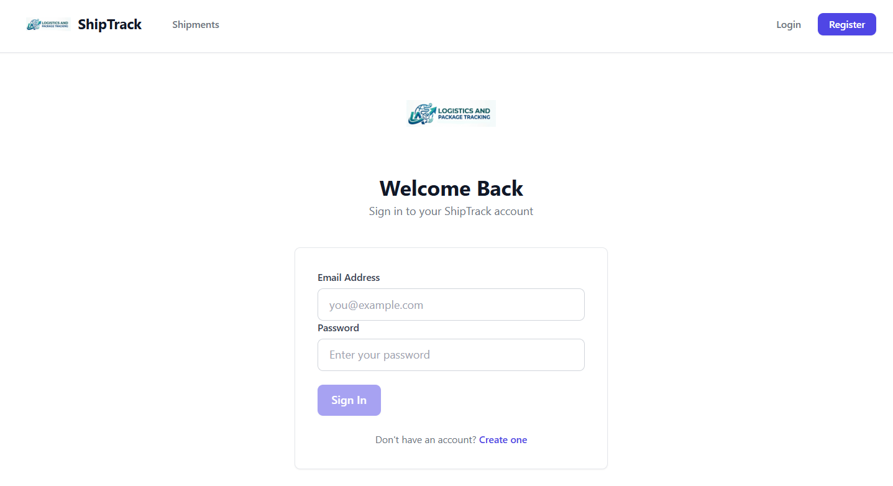
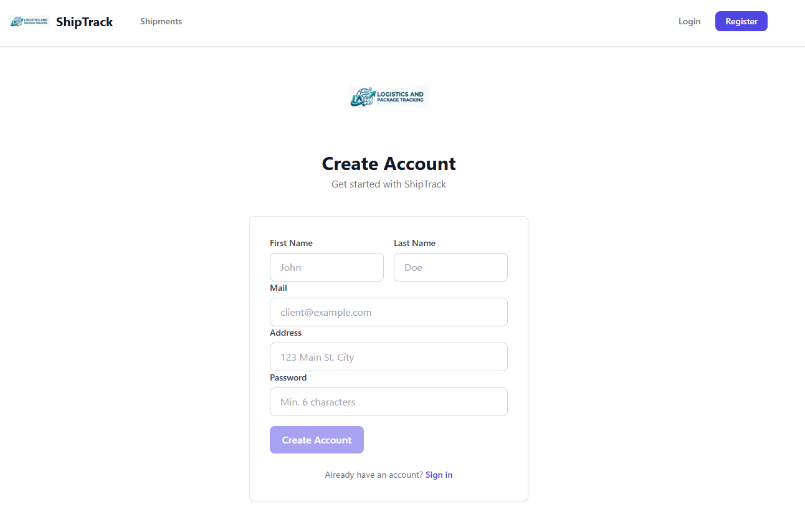
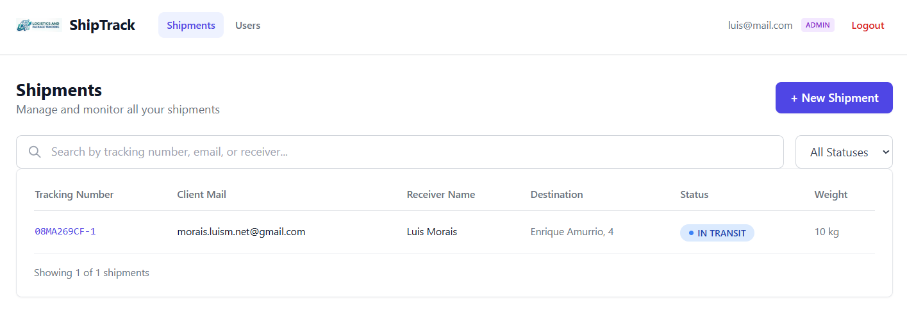
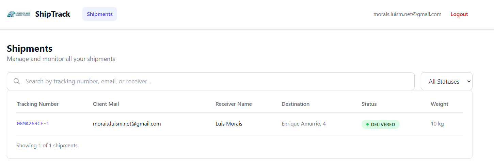
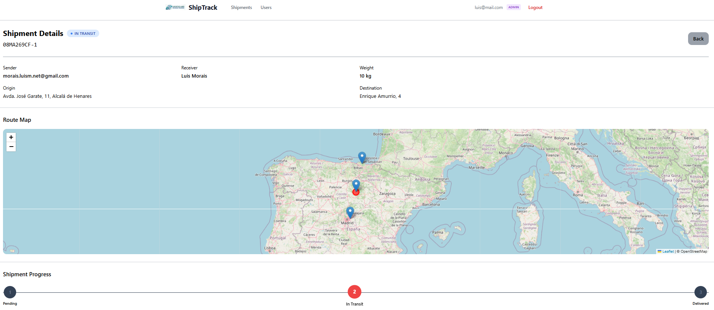
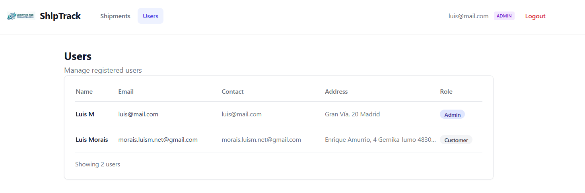

# LogisticsAndPackageTrackingApiNetAngular

Full-stack logistics and package tracking system with an **Angular 20** frontend (standalone components, Tailwind CSS, Leaflet maps) and a **.NET 8** backend following Clean Architecture principles.

---

## Key Features

### Customer Experience
- **Real-time Shipment Tracking** — Track packages by tracking number with an interactive Leaflet map showing origin, destination, and current position markers
- **3-Step Progress Bar** — Visual status indicator (Pending → In Transit → Delivered) with color-coded steps
- **JWT Authentication** — Secure login/register with role-based UI (customers see only their own shipments)
- **Email Notifications** — Automatic delivery confirmation emails via Brevo (Sendinblue) with RabbitMQ-based async processing

### Administration & Management
- **Shipment CRUD** — Create shipments linked to registered users, inline status editing, search/filter by tracking number, email, or receiver
- **User Management** — Admin panel at `/admin/users` to view all registered users and their roles
- **Role-Based Access Control** — Admin/Customer roles enforced via guards and JWT claims on both client and server

### System Features
- **Multi-Database Support** — Runtime-switchable: SQL Server, PostgreSQL, MySQL, SQLite, or MongoDB via configuration
- **Async Messaging** — RabbitMQ with two queues (`email_queue`, `location_queue`) for reliable background processing
- **Automatic Audit Logging** — EF Core interceptor tracks all entity changes (old/new values serialized as JSON)
- **Geocoding** — OpenStreetMap Nominatim for forward/reverse geocoding; IP-to-location via ip-api.com
- **Swagger Documentation** — Interactive API docs with Bearer JWT auth at `/swagger`

---

## Technology Stack

| Layer | Technology |
|-------|-----------|
| **Frontend** | Angular 20, TypeScript 5.9, Tailwind CSS 3.4, Leaflet, RxJS 7.8 |
| **Backend** | .NET 8, ASP.NET Core Web API, C# |
| **Architecture** | Clean Architecture (Domain, Application, Infrastructure, API) |
| **ORM** | Entity Framework Core 8, MongoDB.Driver 3.7 |
| **Auth** | JWT Bearer (custom, no ASP.NET Identity), BCrypt.Net |
| **Messaging** | RabbitMQ (RabbitMQ.Client 7.x) |
| **Databases** | SQL Server, PostgreSQL, MySQL, SQLite, MongoDB |
| **Geocoding** | OpenStreetMap Nominatim, ip-api.com |
| **Email** | Brevo (Sendinblue) HTTP API |
| **Testing** | xUnit, Moq, Microsoft.AspNetCore.Mvc.Testing |
| **Containerization** | Docker, Docker Compose |

---

## Project Structure

```
LogisticsAndPackageTrackingApiNetAngular/
├── LogisticsAndPackageTrackingApiNet/       # .NET 8 Backend (Clean Architecture)
│   ├── LogisticPackageTrackingApiNet.Api/          # Web API entry point, Controllers, Middleware
│   ├── LogisticPackageTrackingApiNet.Application/  # Business logic, Handlers, DTOs, Interfaces
│   ├── LogisticPackageTrackingApiNet.Domain/       # Entities, Repositories interfaces, Common types
│   ├── LogisticPackageTrackingApiNet.Infrastructure/# EF Core, MongoDB, Repositories, RabbitMQ, Geocoding, Email
│   ├── LogisticPackageTrackingApiNet.UnitTests/    # Unit tests (xUnit + Moq)
│   ├── LogisticPackageTrackingApiNet.IntegrationTests/ # Integration tests (WebApplicationFactory)
│   └── LogisticPackageTrackingApiNet.sln
├── LogisticsAndPackageTrackingAngular/      # Angular 20 Frontend
│   ├── src/app/
│   │   ├── core/           # Guards, models, services, auth interceptor
│   │   ├── features/       # Auth (login/register), dashboard, shipments, tracking, admin
│   │   └── shared/         # Reusable components (card, navbar, status-badge, loading-spinner, input)
│   ├── Dockerfile
│   └── nginx.conf
├── docker-compose.yml       # Orchestrates API, Angular, SQL Server, and RabbitMQ
├── start.sh                 # One-command startup script
└── package.json             # Root npm scripts (start/stop/logs/rebuild)
```

---

## Getting Started

### Prerequisites
- [Docker Desktop](https://www.docker.com/products/docker-desktop)
- [.NET 8 SDK](https://dotnet.microsoft.com/download/dotnet/8.0) (for local development)
- [Node.js 20+](https://nodejs.org/) (for local frontend development)

### Quick Start (Docker)

```bash
# Clone and start all services
git clone https://github.com/moraisLuismNet/LogisticsAndPackageTrackingApiNetAngular.git
npm start
```

This starts four containers:
- **Angular frontend** — `http://localhost:4200`
- **.NET API** — `http://localhost:5265` (Swagger at `/swagger`)
- **SQL Server** — port `1433`
- **RabbitMQ** — ports `5672` (AMQP) and `15672` (management UI)

Stop with `npm stop`; view logs with `npm run logs`.

### Development Commands

```bash
# Backend (from LogisticsAndPackageTrackingApiNet/)
dotnet run --project LogisticPackageTrackingApiNet.Api   # Starts API at http://localhost:5096

# Frontend (from LogisticsAndPackageTrackingAngular/)
npm install && npm run dev                                # Starts dev server at http://localhost:4200

# Run tests
dotnet test LogisticPackageTrackingApiNet.UnitTests       # Unit tests
dotnet test LogisticPackageTrackingApiNet.IntegrationTests # Integration tests
npm test                                                    # Angular tests (Karma)

# Database migrations
dotnet ef database update --project LogisticPackageTrackingApiNet.Infrastructure --startup-project LogisticPackageTrackingApiNet.Api
```


---

### Backend

<kbd></kbd>

### Frontend 

<kbd></kbd>  <kbd></kbd>  <kbd></kbd>
<kbd></kbd>  <kbd></kbd>  <kbd></kbd>

---

## 🔗 Links

- [Frontend Documentation](file:///e:/LogisticsAndPackageTrackingApiNetAngular/LogisticsAndPackageTrackingAngular/README.md)
- [Backend Documentation](file:///e:/LogisticsAndPackageTrackingApiNetAngular/LogisticsAndPackageTrackingApiNet/README.md)
- [DeepWiki Project Page](https://deepwiki.com/moraisLuismNet/LogisticsAndPackageTrackingApiNetAngular)

---

Developed by [moraisLuismNet](https://github.com/moraisLuismNet)
